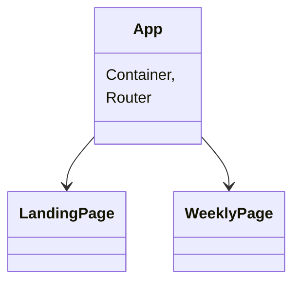

<a name="readme-top"></a>

## Contributors

[![Patt][patt-badge]][patt-url]
<br />
<div align="center">
  <p align="center">
    <h3 align="center"> Cook AHead App</h3>
    <a href="https://github.com/pattpjy/cookAhead"><strong>Explore the docs »</strong></a>
    <br />
    <br />
    <a href="https://github.com/pattpjy/cookAhead/issues">Report Bug</a>
  </p>
</div>

<details>
  <summary>Table of Contents</summary>
  <ol>
    <li>
      <a href="#about-the-project">About The Project</a>
    </li>
    <li>
      <a href="#getting-started">Getting Started</a>
      <ul>
        <li><a href="#installation">Installation</a></li>
      </ul>
    </li>
    <li><a href="#architecture">Architecture</a></li>
    <li><a href="#roadmap">Roadmap</a></li>
    <li><a href="#built-with">Built With</a></li>
      
  </ol>
</details>

## About The Project

Coming up with meals ideas and making decisions for the family meal plans is hard. This is an application that helps user come up with a list of meal ideas. User can also manage the list.

Add vdo walk through


<p align="right">(<a href="#readme-top">back to top</a>)</p>

### Built With

- [![Javascript][javascript.js]][javascript-url]
- [![CSS][css]][css-url]
- [![HTML][html]][html-url]
- [![postman][postman]][postman-url]
- [![API][api]][api-url]
- [![html-react-parser][html-react-parser]][html-react-parser-url]
- [![Git][git]][git-url]
- [![GitHub][github]][github-url]
- [![Vercel][vercel]][vercel-url]


<p align="right">(<a href="#readme-top">back to top</a>)</p>

## Getting Started
Deployed with Vercel [Cook Ahead](https://cook-ahead.vercel.app) 
### Installation

- Clone the repo
   ```sh
   git clone git@github.com:pattpjy/cookAhead.git
   ```
- Install NPM packages
   ```sh
   npm install
   ```
- Run npm start
   ```sh
   npm start
   ```
- Use the Link that is given in the Terminal & Open in Browser
   ```sh
   Example: http://localhost:3000/
   ```

<p align="right">(<a href="#readme-top">back to top</a>)</p>

<!-- ARCHITECTURE -->
## Architecture


<p align="right">(<a href="#readme-top">back to top</a>)</p>
<!-- ROADMAP -->

## Roadmap

- [x] As a user, I can click a button to see random recipes
- [x] As a user, I can save the recipes that I liked and see my saved recipes on my saved recipes page
- [x] As a user, I can delete my saved recipes from my saved recipes page


See the [open issues](https://github.com/pattpjy/cookAhead/issues) for a full list of proposed features (and known issues).
<p align="right">(<a href="#readme-top">back to top</a>)</p>

## Future Additions

- [ ] As a user,I can create a list of ingredients
- [ ] As a user,I can save my list of ingredients to a database
- [ ] As a user,I can save my list of saved recipes to a database

<p align="right">(<a href="#readme-top">back to top</a>)</p>


[patt-badge]: https://img.shields.io/badge/-Patt%20Sookmark-brightgreen
[patt-url]: https://github.com/pattpjy
[css]: https://img.shields.io/badge/CSS-000000?style=for-the-badge&logo=css&logoColor=white
[css-url]: https://www.w3.org/Style/CSS/Overview.en.html
[vercel]:https://img.shields.io/badge/vercel-15EA75?style=for-the-badge&logo=vercel&logoColor=white
[vercel-url]:https://vercel.com/
[html]: https://img.shields.io/badge/HTML-4A4A55?style=for-the-badge&logo=HTML&logoColor=FF3E00
[html-url]: https://www.w3schools.com/howto/howto_make_a_website.asp
[javascript.js]: https://img.shields.io/badge/JavaScript-0769AD?style=for-the-badge&logo=javascript&logoColor=white
[javascript-url]: https://www.javascript.com/
[postman]:https://img.shields.io/badge/Postman-4A4A55?style=for-the-badge&logo=postman&logoColor=FF3E00
[postman-url]:https://www.postman.com/

[html-react-parser]:https://img.shields.io/badge/HTMLReactParser-4A4A55?style=for-the-badge&logo=HTMLReactParser&logoColor=FF3E00
[html-react-parser-url]:https://www.npmjs.com/package/html-react-parser

[api]: https://img.shields.io/badge/API-15EA75?style=for-the-badge&logo=HTML&logoColor=FF3E00
[api-url]: https://www.w3schools.com/js/js_api_intro.asp
[github]: https://img.shields.io/badge/GitHub-22043C?style=for-the-badge&logo=github&logoColor=FF3E00
[github-url]: https://github.com/
[git]: https://img.shields.io/badge/Git-2E0305?style=for-the-badge&logo=git&logoColor=FF3E00
[git-url]: https://git-scm.com/
